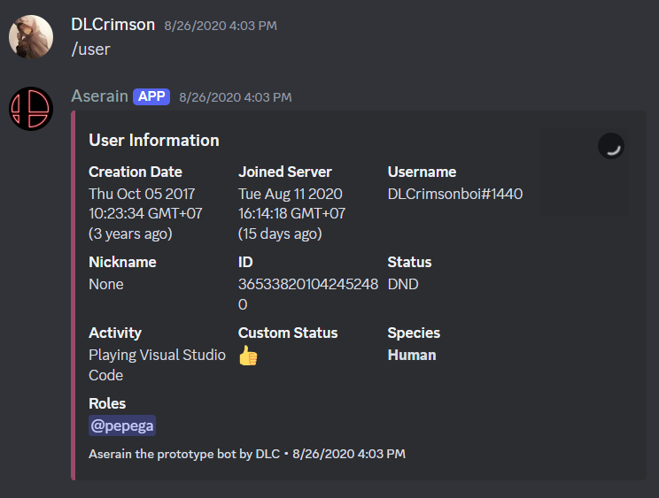

# Discord Bot - Aserain

## Overview

Aserain is a Discord bot built using **DiscordJS** and **NodeJS**. Designed for server automation, moderation, and for fun of course.

## Features

- **Moderation Tools**: Kick, report, and manage server users efficiently.
- **Utility Commands**: Fetch user info, check server status, and display bot uptime.
- **Fun & Engagement**: Play rock-paper-scissors, fetch random cat and dog images.
- **Channel Management**: Create and delete channels dynamically.
- **Customization**: Supports user-requested features with easy configuration.

## Commands

Here are some of the available commands:

| Command        | Description                                |
| -------------- | ------------------------------------------ |
| `!kick @user`  | Kicks the mentioned user from the server.  |
| `!ping`        | Checks the bot's response time.            |
| `!serverinfo`  | Displays server information.               |
| `!user @user`  | Fetches information about a specific user. |
| `!cat`         | Sends a random cat image.                  |
| `!dog`         | Sends a random dog image.                  |
| `!rps rock`    | Plays rock-paper-scissors.                 |
| `!repeat text` | Repeats the provided text.                 |

## Showcase

## Technologies Used

- **Node.js** - Runtime environment
- **Discord.js** - Discord API wrapper for Node.js
- **JavaScript** - Main programming language

## Notes

This project is no longer supported. If you like what I did, you can request me for a new one <3.

## License

This project is licensed under the MIT License.

---

Developed by DLCRIMSON 🚀
